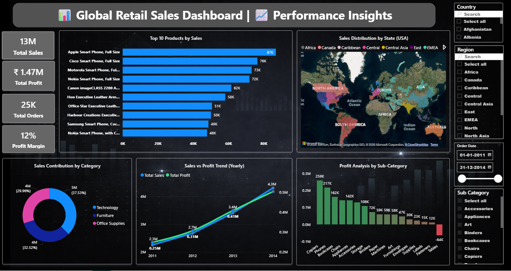

# Global Retail Sales Dashboard (Power BI)

## 📊 Overview
This project analyzes global retail sales performance using Power BI to generate insights on sales, profit, and customer trends.

## 🚀 Key Insights
- Profit is impacted by loss-making sub-categories despite strong sales
- Identified top-performing products contributing to revenue
- Regional analysis highlights high-growth and underperforming markets

## 📌 Features
- KPI Tracking (Sales, Profit, Profit Margin)
- Category and Sub-category Analysis
- Regional Sales Distribution (Map Visualization)
- Interactive Filters (Region, Country, Date)

## 🛠 Tools Used
- Power BI
- Power Query
- Data Modeling

## 📂 Dataset
Superstore dataset containing sales, profit, and order details.

## 📸 Dashboard Preview

## 📈 Business Impact
Helps businesses identify profitable products, reduce losses, and improve decision-making using data-driven insights.

## ⚠️ Note
The Discount column in the dataset was derived from Power BI calculations and then exported to ensure consistency between the dataset and dashboard.
